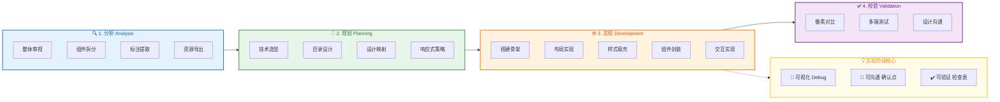

# 前端设计稿还原工作流

> 核心理念：**分析 → 规划 → 实现 → 校验**
> 实现阶段强调：**可视化、可沟通、可验证**

## 工作流概览



### 阶段说明

| 阶段 | 颜色 | 核心任务 |
|------|------|---------|
| 🔍 分析 | 🔵 蓝色 | 理解设计稿，拆分组件，确认组件库映射 |
| 📐 规划 | 🟢 绿色 | 技术选型，建立设计系统，规划响应式 |
| ⚙️ 实现 | 🟠 橙色 | 可视化开发，Debug模式，与用户持续沟通 |
| ✅ 校验 | 🟣 紫色 | 像素级还原，多端验证，交付检查 |

## 关键原则

```
不要一上来就写代码，先理解再动手
```

- **先整体后局部**：避免陷入细节
- **先静态后动态**：结构稳定后再加交互
- **保持与设计沟通**：遇到不清楚的地方及时确认

## 文档目录

| 文件 | 阶段 | 说明 |
|------|------|------|
| [project-analysis-report.md](./project-analysis-report.md) | 📊 分析报告 | **项目分析结果记录，快速定位所需工作流** |
| [01-analysis.md](./01-analysis.md) | 分析阶段 | 设计稿解读、组件拆分、资源提取 |
| [02-planning.md](./02-planning.md) | 规划阶段 | 技术选型、目录设计、设计系统映射 |
| [03-implementation.md](./03-implementation.md) | 实现阶段 | 可视化开发、Debug模式、组件规范 |
| [04-validation.md](./04-validation.md) | 校验阶段 | 还原对比、多端测试、交付检查 |

## 工具文件

| 文件 | 说明 |
|------|------|
| [tools/debug.css](./tools/debug.css) | Debug样式（彩色区块、断点指示器） |
| [tools/debug-mode.js](./tools/debug-mode.js) | Debug控制脚本（Ctrl+Shift+D） |

## 快速开始

```
┌─────────────────────────────────────────────────────────────┐
│  0. 先分析项目 → 填写 project-analysis-report.md            │
│     ↓                                                       │
│     根据分析报告，确定需要执行哪些工作流                      │
└─────────────────────────────────────────────────────────────┘
```

1. **分析项目**：执行项目检测 → 填写 [project-analysis-report.md](./project-analysis-report.md)
2. **分析设计稿**：拿到设计稿 → 完成 [01-analysis.md](./01-analysis.md) 的确认清单
3. **规划**：确定技术方案 → 按 [02-planning.md](./02-planning.md) 建立项目结构
4. **实现**：引入debug工具 → 按 [03-implementation.md](./03-implementation.md) 可视化开发
5. **校验**：对照 [04-validation.md](./04-validation.md) 检查清单 → 交付
