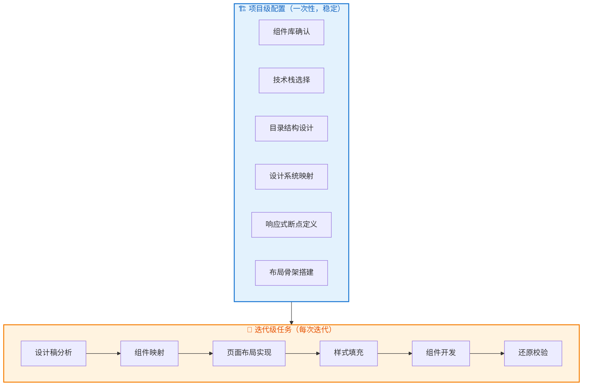

# 前端设计稿还原工作流

> 核心理念：**分析 → 规划 → 实现 → 校验**
> 工作流分为：**项目级（一次性）** 和 **迭代级（每次迭代）**

---

## 工作流概览



---

## 项目级 vs 迭代级

| 类型 | 频率 | 内容 | 特点 |
|------|------|------|------|
| 🏗️ **项目级** | 一次性 | 技术栈、组件库、骨架布局、设计系统 | 稳定，很少变动 |
| 🔄 **迭代级** | 每次迭代 | 设计稿分析、组件映射、页面实现、校验 | 每次都做 |

---

## 文档目录

### 分析报告

| 文件 | 说明 |
|------|------|
| [project-analysis-report.md](./project-analysis-report.md) | 📊 **项目分析报告**（项目级配置 + 迭代级分析模板） |

### 工作流文档

| 文件 | 项目级内容 | 迭代级内容 |
|------|-----------|-----------|
| [01-analysis.md](./01-analysis.md) | 🏗️ 组件库检查与确认 | 🔄 设计稿分析、组件映射、二次封装 |
| [02-planning.md](./02-planning.md) | 🏗️ 技术栈、目录结构、设计系统、断点 | - |
| [03-implementation.md](./03-implementation.md) | 🏗️ 布局骨架搭建 | 🔄 页面布局、样式填充、组件开发 |
| [04-validation.md](./04-validation.md) | - | 🔄 像素对比、多端测试、交付检查 |

### 工具文件

| 文件 | 说明 |
|------|------|
| [tools/debug.css](./tools/debug.css) | Debug样式（彩色区块、断点指示器） |
| [tools/debug-mode.js](./tools/debug-mode.js) | Debug控制脚本（Ctrl+Shift+D） |

---

## 快速开始

### 🏗️ 新项目流程

```
┌─────────────────────────────────────────────────────────────┐
│  新项目：先完成项目级配置                                     │
├─────────────────────────────────────────────────────────────┤
│                                                             │
│  1. 填写 project-analysis-report.md 第一部分（项目级配置）   │
│                                                             │
│  2. 执行项目级工作流:                                        │
│     ├── 01-analysis.md → 🏗️ 组件库检查与确认                │
│     ├── 02-planning.md → 🏗️ 技术栈、目录结构、设计系统      │
│     └── 03-implementation.md → 🏗️ 布局骨架搭建              │
│                                                             │
│  3. 然后进入迭代级流程 ↓                                     │
│                                                             │
└─────────────────────────────────────────────────────────────┘
```

### 🔄 每次迭代流程

```
┌─────────────────────────────────────────────────────────────┐
│  每次迭代：只做迭代级任务                                     │
├─────────────────────────────────────────────────────────────┤
│                                                             │
│  1. 复制 project-analysis-report.md 第二部分（迭代级分析）   │
│                                                             │
│  2. 执行迭代级工作流:                                        │
│     ├── 01-analysis.md → 🔄 设计稿分析、组件映射            │
│     ├── 03-implementation.md → 🔄 页面布局、样式、组件      │
│     └── 04-validation.md → 🔄 还原校验、多端测试            │
│                                                             │
│  3. 完成后将分析记录移至存档区                               │
│                                                             │
└─────────────────────────────────────────────────────────────┘
```

---

## 关键原则

```
不要一上来就写代码，先理解再动手
```

- **先整体后局部**：避免陷入细节
- **先静态后动态**：结构稳定后再加交互
- **保持与设计沟通**：遇到不清楚的地方及时确认
- **项目级配置稳定**：技术栈、骨架布局不轻易变动
- **迭代级专注页面**：每次迭代专注于新页面/组件的实现
